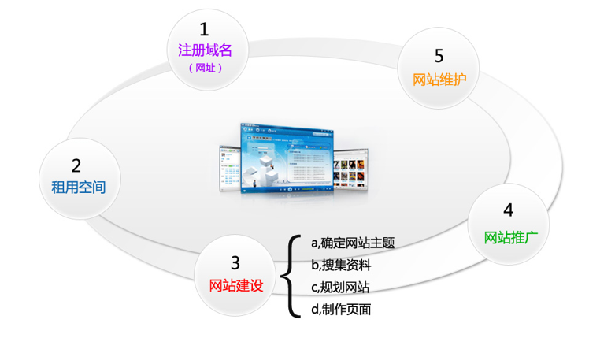
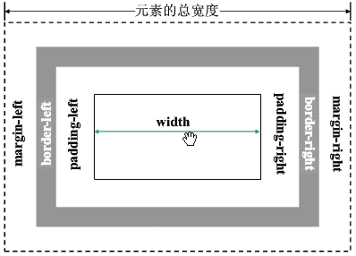
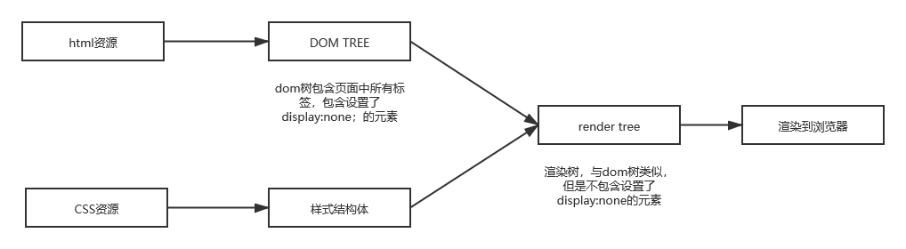

# DAY 01

# 第1章 HTML

1. 相关部门
   + 产品
   + UI
   + **前端**
   + 后端
   + 测试
   
2. 

3. 网页的组成

   + 网页的**结构**：图片、文字、线条、超链接、视频。网页的骨架
   + 网页的**表现**：网页的衣服：美观、漂亮
   + 网页的**行为**：让元素动起来

4. WEB标准：制作网页的标准，一系列标准的集合

   ​				结构	->	html语言	【W3C】

   ​				表现	->	CSS语言	【W3C】

   ​				行为	->	JavaScript	【ECMA】

   web标准由W3C【万维网联盟】和ECMA【欧洲电脑网商联合会】组织颁发

5. 计算机语言的发展：机器语言、汇编语言、高级语言

## HTML语言

1. HTML：超文本标记语言

   XHTML：可扩展的超文本标记语言（版本升级的遗留）【语法上更加严格】

   HTML5：第五次重大修改

2. 站点的创建

   + 文件夹的命名：不要有中文、小写英文字母开头

3. 前端的涉及到的环境

   + dev环境：开发环境，外部用户无法访问，版本更新变动较大
   + pro环境：面向用户，联网即可访问
   + test环境：测试环境，对内开放，版本稳定

## 常用html标签

1. 文本标题标签 h1~h6

   + h1具有唯一性，每个页面只能出现一次，一般用来包裹logo
   + 标题标签不能互相嵌套

# DAY 02

2. 字体倾斜 

   ```txt
   <i></i>
   <em></em>     具有语气强调的作用
   ```

3. 字体加粗

   ```txt
   <b></b>     h5里面不被推荐使用
   <strong></strong>     具有语气强调的作用，表示着重
   ```

4. 下划线

   ```txt
   <u></u>
   ```

5. 换行     br     不要大面积使用

6. 水平线     hr    不常用，后期线条大部分都是用CSS边框实现的

7. 上标和下标

   ```txt
   <sup></sup>
   <sub></sub>
   ```

8. 段落    p    **p标签里面不能嵌套标题标签**

9. 字符    span    一小段文本

10. 常用转义字符

    ```txt
    &nbsp;     不换行空格，写页面的时候不要大面积出现
    &gt;       >右尖括号
    &lt;       <左尖括号
    &copy;     备案中图标版权 ©
    ```

11. 列表

    1. 无序列表    ul  >  li

       + 列表符号一般都是要清除的，因为存在兼容问题
       + 实际开发中的列表符号一般都是用背景图
       + 应用：新闻条、网页主导航条

    2. 有序列表    ol  >  li

       + 列表的属性

         **type**

         ​	属性值	1（数字），a（小写字母），A（大写字母），i（小写罗马数字），I（大写罗马数字）

         **start**

         ​	属性值	必须是数字，表示有序列表的的起始点

       + 实际开发中一般使用无序列表

    3. 自定义列表    dl  >  dt  dd

       + 实际开发中，一般是图片dt+图片的解释dd
       + 一般情况下一个dl里面不会出现多组dt  dd

12. 超链接     a

    属性    href，title（大部分标签都支持title属性）

    target=“_blank     /     _self”

    ​	_blank    在新窗口打开

    ​	_self    默认，在当前窗口打开

    + 如果用a模拟按钮，a可以绑定一些其他的功能，比如切换轮播图
    + 空链接  href="###"
    + 按钮 href="javascript:void(0);"
    + 扩展属性  rel="nofollow"   给页面中的其他链接设置后，减少其他页面的曝光率

13. 图片    img

    属性    src，width，height，border

    alt

    + 一般情况下小于100字符
    + 必须属性，可以空着不能没有
    + 搜索引擎搜索不到图片上面的文字，检索的是alt，alt就是用来做优化的

    **图片title和alt的区别**

    ```txt
    alt:
            1、alt属性是考虑到不支持图像显示或者图像显示被关闭的浏览器的用户，以及视觉障碍的用户和使用屏幕阅读器的用户。当图片不显示的时候，图片的替换文字。
            2、alt属性值得长度必须少于100个英文字符
            3、alt属性是img标签的必须属性，如果没有特别意义的图片，可以写alt=""
            4、alt属性是搜索引擎判断图片与文字是否相关的重要依据，alt属性添加到img主要的目的才是为了SEO
            
    SEO：搜索引擎优化
            
    title:
        	1、title属性并不是必须的。
            2、title属性规定元素的额外信息，有视觉效果，当鼠标放到文字或是图片上时有文字显示。
            3、title属性并不作为搜索引擎抓取图片的参考，更多倾向于用户体验的考虑。
    ```


14. 盒子    div    划分网页区域

15. 表格    table  >  tr  >  td    作用：显示数据
    
    + 属性    width，height，bordercolor，bgcolor，cellspacing（单元格和单元格之间的间距），cellpadding（单元格和内容之间的间距），align，valign（垂直对齐方式top、bottom、middle）
    
    + **合并行**    rowspan        **合并列**    colspan
    
      区分方式：跨行的就是合并行，否则就是合并列
    
      如果既合并行又合并列，先合并列
    
    + 表格内部标签    th标签 （表头 / 列标题，加粗，水平居中）   caption标签（表名）
    
    + 数据行分组  thead   tbody    tfoot
    
      在一个表格内，只能有一个thead / tfoot，但是可以有多个tbody
    
      数据列分组 ``` <colgroup span="2"></colgroup>```
    
16. 表单    form    作用：收录用户信息

    + 表单元素：

      1. 文本框（输入框）```<input type="text" value="请输入...">```

      2. 密码框```<input type="password">```

      3. 提交按钮```<input type="submit">```

      4. 重置按钮```<input type="reset">```

      5. 空按钮```<input type="button" value="按钮上的文本">```

      6. 单选按钮```<input type="radio">```    每一组单选按钮，name属性保持一致

      7. 多选按钮```<input type="checkbox">```

      8. 文件上传```<input type="file">```

      9. 下拉菜单    只有在表单中出现下拉菜单才使用select

         ```
         <select name="" id="">
         	<option value=""></option>
         	<option value=""></option>
         	<option value=""></option>
         	<option value="" selected></option>
         </select>
         
         selected 默认选中
         ```

      10. 多行文本域    ```<textarea cols="" rows=""></textarea>```

          + cols和rows是以字符为单位，一般不用

          + 默认情况下，用户可以拖拽改变多行文本域的大小，通过设置CSS可以禁止用户拖拽```resize:none;```

    + input里面的属性：

      ​	type：决定input在页面中的显示状态

      ​	value：type不同，value的作用也不同

      ​	maxlength：输入字符的最大长度

      ​	name：表单元素的名称

      ​	size：字符为单位，控制input的大小，一般不用

    + 表单按钮的属性：

      ​	默认选中：checked

      ​	禁止选中：disabled
      
    + 表单的属性：

      action=""    接口地址

      name=""    表单的名称

      method="get / post"    数据提交的方式

    + 表单的标签

      + fieldset    表单字段集，可以相互嵌套，默认有边框

      + legend    表单字段集标题，一般放在fieldset第一个子元素位置

      + label：提示信息```<label for="userName">姓名：</label>```

        for属性绑定表单元素的ID名

        ```
        <form action="">
        	<fieldset>
        		<legend>个人信息</legend>
        			<p>
                        <label for="userName">姓名:</label>   
                        <input type="text" id="userName">
                  </p>
                    <p>
                      <label>性别：</label>
                        <input type="radio" name="sex" id="man"><label for="man">男</label>
                        <input type="radio" name="sex" id="woman"><label for="woman">女</label>
                    </p>
                </fieldset>
                <fieldset>
                    <legend>其他信息</legend>
                    <fieldset>
                        <legend>喜欢这个表单</legend>
                    </fieldset>
                    <fieldset>
                        <legend>运动</legend>
                    </fieldset>
                    <fieldset>
                        <legend>建议</legend>
                    </fieldset>
                </fieldset>
            </form>
        ```
        

    + 注：每个表单元素每一行最好放在一个P标签里面
    
    + **get / post的区别**
    
      ```
      1.get一次传输完数据（header+data），post先发送header，收到响应后，再发送data
      2.get是直接把参数放在URL之后，post放在数据包中
      3.get请求有大小限制，不同的浏览器和服务器对大小的限制是不同的，post请求没有大小限制
      4.get请求只产生一个数据包，post请求产生两个
      5.get一般用来从服务器端获取数据，post一般用来提交数据
      6.get是幂等的，即读取同一个资源，总是得到相同的数据，post，因为每次请求对资源的改变并不是相同的；进一步地，get不会改变服务器上的资源，而post会对服务器资源进行改变；
      
      误区：post比get安全
      他们都不安全，因为http本身是明文协议，这两种传输方式在底层没有区别，除非加密（HTTPS）
      ```
    
# DAY 03

# 第2章 CSS基础

1. CSS语法由两部分组成：选择符、声明

   声明包括：属性和属性值

   选择符 {属性: 属性值 ;属性:属性值}

2. 样式表的分类    行内样式表、内部样式表（**最好**放在head里面）、外部样式表

   + 行内样式表权重最高，内部样式表和外部样式表，跟书写顺序相关，后面的会覆盖前面的
   + 只要产生权重关系，必然会产生CSS的层叠性：相同属性，权重高的覆盖权重低的，不同属性继续执行

3. link和@import的区别

   + 差别1：本质区别

     ​	link是一个标签，由HTML提供

     ​	@import是CSS的一个方法，由CSS提供

   + 差别2：加载顺序的差别

     ​	link是HTML的一个标签，页面加载的时候，link导入的样式和结构同时加载

     ​	@import要等结构加载完毕，再加载样式

   + 差别3：兼容性的差别。

     ​	@import是CSS2.1提出的，所以老的浏览器不支持，@import只在IE5以上的才能识别

     ​	link标签无此问题。

   + 差别4：使用dom控制样式时的差别

     ​	当使用javascript控制dom去改变样式的时候，只能使用link，因为@import不是dom可以控制的.

4. CSS选择符分类

   1. 类型选择符（标签选择符）
      + 改变元素默认样式的时候用的最多
   2. 类选择符 （class选择符）
      + 更适合定义一类样式
   3. ID选择符 （id选择器）
      + 划分网页外围结构
   4. 伪类选择器
   5. 通配符（*）设置全局属性
   6. 群组选择符（集合选择器）
   7. 包含选择符（后代选择器）
   8. 属性选择符
   9. 伪对象选择符

5. 伪类选择器

   a:link {color: red;}                    未访问的链接状态 
   a:visited {color: green;}		   已访问的链接状态 
   a:hover {color: blue;}                  鼠标滑过链接状态
   a:active {color: yellow;}               鼠标按下去时的状态 

   + 当这4个超链接伪类选择符联合使用时，应注意他们的顺序，正常顺序（love-hate）为：
     a，a:link,a:visited,a:hover,a:active,错误的顺序有时会使超链接的样式失效；
   + 滑过父元素更改子元素样式，滑过谁就给谁加hover，仅通过CSS，不能滑过子元素更改父元素

6. 选择符起名

   + 尽量使用小写英文字母开头
   + 不能使用汉字
   + 可以连接数字、字母、下划线、连字符
   + 名字尽量简短，并且反映板块的用途或结构，**名字一定不要太长**
   + 起名方法：驼峰命名，连字符命名法、下划线命名法
   + 命名不能使用关键字

7. 选择符的权重

   内联 1000 > ID 100 > class，伪类，属性选择符 10 > 标签 1

   !imporant   权重最高

# 第3章 CSS属性

1. CSS属性值：常规属性值加单位；法定属性值

#### 文本属性

1. 文本大小    font-size

   + 单位还可以是pt，9pt=12px
   + 默认1em=16px，em会根据文本所在父元素的字体大小进行变化
   + PC端文本大小尽量设置为偶数，不要用奇数
   + PC端文本大小不要小于12px
   + PC中的汉字的文本大小，量取文本高度即可，同等字号，英文和数字比字号略小
   + rem 类似em，相对大小单位，根据html的font-size值
   + 文字：顶线、中线、基线、底线

2. 文本颜色    color

   + 十六进制表示颜色值，当三原色的三组数字相同的时候，可以缩写为三位，0表示最暗的颜色，f表示最亮的颜色
   + rgb()模式    rgba(255,0,0,0.5)    0.5表示透明度
   + 了解 CSS3    HSL模式（颜色饱和度）    hsla(H,S,L,透明度) PS可以获取

3. 文本类型    font-family

   + 属性值可以有很多，当字体是中文或者英文字体中含有空格的时候，需要加双引号
   +  中文字体默认“微软雅黑”，英文默认“Arial”
   + WEB安全字体：设备或操作系统能识别的字体
   + 可以设置多种字体（备胎），**逗号**隔开
   + 如果出现中文字体和英文字体，先写英文字体，再写中文字体
   + 当设置中文字体，不起作用的时候，要将字体的名字改成对应的英文（百度）

4. 文字加粗    font-weight

   + 字体的粗细分为九个等级，100-900，一般500为常规字体
   + bold（加粗）、bolder、normal（常用）

5. 文字倾斜    font-style

   + 属性值：italic、oblique、normal
   + 属性值的区别，二者都是向右倾斜的文字，但是italic是指斜体字，oblique指的是倾斜的文字

6. 文字行高    line-height

   + 当单行文本的行高等于容器的高度的时候，可以实现单行文本在容器中垂直居中
   + line-height    >    height     ，文本向下；line-height    <    height     ，文本向上

   注：font简写（顺序不能变）：font:font-style  font-weight  **font-size/line-height**  font-family

   ​		只有同时制指定文字大小和文字类型的时候，简写才起作用

7. 水平对齐方式    text-align    justify（两端对齐）

8. 文本修饰    text-decoration

   + 属性值：none，underline（下划线），overline（上划线），line-through（删除线）

9. 首行缩进    text-indent

   + 可以取负值（悬挂式缩进）
   + 单位常用em
   + 取一个绝对值很大的负数，可以用于隐藏内容

10. 字间距、词间距 

    + 字间距```letter-spacing:value;```    控制英文字母或汉字的字距
    + 词间距```word-spacing:value;```    控制英文单词的词距，中文的话加空格也可以设置词间距

#### 列表属性

1. 定义列表符号样式    list-style-type
   + 属性值：disc（实心圆），circle（空心圆），square（实心方块），none
   + 属性值有很多形式，不只是上面那几种，但是一般情况下不用，因为存在一些兼容问题
   + list-style-type:none   ===   **list-style:none; **   去掉列表符号
2. 使用图片作为列表符号    ``` list-style-image:url();```
3. 定义列表符号的位置    list-style-position
   + 属性值：outside（外边，默认）， inside（里面），inherit（规定从父元素继承该属性的属性值）

#### 边框属性

+ 边框的位置：在宽高以外，边框的宽度不包含在容器宽高里面
+ 简写    border:宽度  样式  颜色;    border:0;常用于清除边框
+ 下面三个属性最多都能接收四个值
+ 透明色    transparent

1. 边框样式    border-style
   + 属性值：solid（实线），dashed（虚线），dotted（点状线），double（双线），none
2. 边框宽度    border-width
3. 边框颜色    border-color

#### 背景属性

+ 简写    background:颜色  url  平铺  位置1  位置2;

1. 背景颜色    background-color
2. 背景图片    background-image
3. 背景图的平铺    background-repeat
4. 背景图的位置属性    background-position：水平方向left/center/right/数值   垂直方向top/center/bottom/数值
   + 可以接收负值
   + 一个值center，水平垂直居中
5. 背景图的固定性    background-attachment
   + 属性值：scroll（滚动），fixed（固定）

#### 表格属性

1. 单元格间距    border-spacing:value;    
   + 该属性必须给table添加
   + 不可以取负值
2. 合并相邻单元格的边框    border-collapse
   + 属性值    separate（边框分开），collapse（边框合并）
   + 该属性要给table添加
3. 无内容时单元格的设置    empty-cells
   + 属性值    show（显示），hide（隐藏）
   + 定义当单元格无内容的时候，是否显示该单元格的区域
4. 显示单元格行和列的算法    table-layout
   + 属性值    auto（自动分配，缺陷：性能消耗），fixed（并不是固定死宽度，而是不会根据内容的量来分配宽度，趋于自动平分，并不是完全自动平分）
   + 判断内容量，内容多，宽度大，反之相反
   + fixed：中文会自动换行，但是连续的英文和数字不会，因为将连续的英文看做了一个单词

#### 浮动

1. 子元素浮动，父元素暂时必须添加高度，不然撑不开
2. 多个元素有浮动，外层要套一个父元素，不要影响上下布局

#### CSS属性继承

```txt
不可继承的：display、margin、border、padding、background、height、min-height、max- height、、min-width、max-width、overflow、position、left、right、top、 bottom、z-index、float、clear、table-layout、vertical-align

所有元素可继承：visibility和cursor。
内联元素可继承：letter-spacing、word-spacing、line-height、color、font、 font-family、font-size、font-style、font-variant、font-weight、text- decoration、text-transform。
块状元素可继承：text-indent和text-align
列表元素可继承：list-style、list-style-type、list-style-position、list-style-image。
表格元素可继承：border-collapse
```

# DAY 04

# 第4章 盒模型

1. 标准盒模型

   

2. padding

   + padding会把盒子撑大
   + padding不会对背景图造成影响
   + padding不接受负值

3. margin

   + ```margin:0 auto;```    让当前元素在父元素中水平居中
   + margin常出现的两个bug
     1. 两个相邻元素上下的margin值不会叠加，按照较大值设置，左右不会有这种情况
     2. 如果父元素和第一个子元素没有浮动的情况下，给第一个子元素添加margin-top，会错误的放在父元素上面
   + 可以接收负数

4. 盒子大小的计算

   

   

   #### 写网页

   1. 每个项目的命名风格尽量一致

      eg:    外围结构    驼峰命名    id

      ​         版心    连字符    nav-con    class

      ​         内部板块    下划线    nav_left    class

   2. CSS文件规划：

      + 重置样式表
      + 公共样式表
      + 页面自身的样式表
      
   3. 页面一定要写注释

   4. 按钮的border长在里面
   
   5. 网页的主导航一般都是通过ul实现的
   
   6. 不在表单中的按钮都用a去模拟
   
   7. display:inline-block；代码换行的话，两个块之间会有默认间距
   
   8. 图片img标签之间默认有一小条空白，把img转成块block就没有了
   
### 文本溢出

1. overflow
   
   visible    默认值，内容不会被修剪，会显示在元素框之外
   
   hidden    内容会被修剪，并且其余内容是不可见的
   
   scroll    内容会被修剪，但是浏览器会显示 滚动条
   
   auto    如果内容被修剪，浏览器会显示滚动条
   
   inherit    规定从父元素继承该属性的属性值
   
2. white-space
   
      normal    默认值，多余空白会被浏览器忽略，只保留一个
   
      pre    空白会被浏览器保留
   
      pre-wrap    保留一部分空白序列，但是进行正常的换行
   
   pre-line    合并空白符序列，但是保留换行符
   
   nowrap    文本不会换行，文本会在同一行上继续，知道遇到强制换行符br为止
   
3. text-overflow

   clip    不显示省略号，而是进行简单的裁切

   ellipsis    当对象内文本溢出时，显示省略标记

4. 文本溢出变省略号设置

   **必须是单行文本才能设置本文溢出！！！**

   ```txt
   text-overflow属性仅是：当文本溢出时是否显示省略标记，并不具备其它的样式属性定义，要实现溢出时产生省略号的效果还需定义：
   1、容器宽度：width：value；（px、%，都可以）
   2、强制文本在一行内显示:white-space：nowrap;
   3、溢出内容为隐藏：overflow：hidden；
   4、溢出文本显示省略号：
        text-overflow：ellipsis;
   ```

   ```
   文本溢出省略号显示：
           white-space:nowrap;
           overflow:hidden;
           text-overflow:ellipsis;
           width:;
   ```

# DAY 05

# 第5章 元素类型

   1. 块状元素、内联元素、可变元素

   2. 常见的块元素：

      dl - 和dt-dd 搭配使用的块级元素

      form - 交互表单

      hr - 水平分隔线

      ol – 有序列表

      ul - 无序列表

      li

      fieldset - 表单字段集

      colgroup-col - 表单列分组元素

      table-tr-td  表格及行-单元格

   3. 常见的内联元素

      br - 换行

      img - 图片 

      input - 输入框               

      label - 表单标签    

      textarea - 多行文本输入框

      select - 项目选择  

   4. display的属性值

      | none               | 此元素不会被显示。                                           |
      | ------------------ | ------------------------------------------------------------ |
      | **block**          | **此元素将显示为块级元素，此元素前后会带有换行符。**         |
      | **inline**         | 此元素会被显示为内联元素，元素前后没有换行符。**             |
      | **inline-block**   | **行内块元素。（CSS2.1 新增的值）**                          |
      | **list-item**      | **此元素会作为列表显示。**                                   |
      | run-in             | 此元素会根据上下文作为块级元素或内联元素显示。               |
      | compact            | CSS 中有值 compact，不过由于缺乏广泛支持，已经从 CSS2.1 中删除。 |
      | marker             | CSS 中有值 marker，不过由于缺乏广泛支持，已经从 CSS2.1 中删除。 |
      | table              | 此元素会作为块级表格来显示（类似 <table>），表格前后带有换行符。 |
      | inline-table       | 此元素会作为内联表格来显示（类似 <table>），表格前后没有换行符。 |
      | table-row-group    | 此元素会作为一个或多个行的分组来显示（类似 <tbody>）。       |
      | table-header-group | 此元素会作为一个或多个行的分组来显示（类似 <thead>）。       |
      | table-footer-group | 此元素会作为一个或多个行的分组来显示（类似 <tfoot>）。       |
      | table-row          | 此元素会作为一个表格行显示（类似 <tr>）。                    |
      | table-column-group | 此元素会作为一个或多个列的分组来显示（类似 <colgroup>）。    |
      | table-column       | 此元素会作为一个单元格列显示（类似 <col>）                   |
      | table-cell         | 此元素会作为一个表格单元格显示（类似 <td> 和 <th>）          |
      | table-caption      | 此元素会作为一个表格标题显示（类似 <caption>）               |
      | inherit            | 规定应该从父元素继承 display 属性的值。                      |

   5. 大部分内联元素的display属性值默认为inline,其中img,input，默认为inline-block（行内块元素）。

   6. 块元素和内联元素的显示特点

      + 内联元素在默认的情况下，如果给父元素设置text-align/line-height，会使整个内联元素发生位置变化
      + 给元素设置display:none;之后，页面加载的时候还是会加载

   7. 页面是怎么渲染的

      + DOM树包含页面中所有标签，包含添加了display:none的元素
      + 

   8. 置换元素和非置换元素

      为什么图片的display的值为inline，但是能添加大小？

      因为图片img是置换元素，置换元素在页面渲染的过程中会生成一个框，这个框可以添加宽高

   9. 让一个元素在父元素里面垂直居中

      原理：在需要垂直居中的元素后面加一个宽度为0，与父元素等高的span元素，让二者垂直对齐

      元素：display:inline-block;  vertical-align:middle;

      不可见元素：vertical-align:middle;  width:0;  height:100%;  display:inline-block 

   10. 元素嵌套规则：

       + 尽量让块状元素作为父元素
       + 内联元素尽量不要嵌套块级元素
       + h1~h6之间不能互相嵌套
       + p标签不能互相嵌套，p标签内尽量放内联元素
       
   11. display:none;   不参与CSS3动画的过渡

# DAY 06

# 第6章 定位

1. CSS三种基本定位机制：普通流、浮动流、定位流

2. 包含块~定位元素的参照物

   给绝对定位元素的父元素添加声明position：relative；

3. 定位元素的层次关系 z-index，默认auto，可以接收数值（可以负数），数值越大，越优先显示

#### position

1. absolute
   + 脱离文档流，不占据空间
   + 参照物：已经添加定位的父元素
   + 如果父元素都没有定位，或者没有父元素，参照物是整个页面
2. relative
   + "魂飞了，人还在"
   + 与父元素无关，参照物是元素本身
3. sticky
   + 存在兼容问题

| s**tatic**   | **默认值。位置设置为 static 的元素会正常显示，它始终会处于文档流给予的位置（static元素会忽略任何 top、bottom、left或 right 声明）** |
| ------------ | :----------------------------------------------------------- |
| **absolute** | **相对于父级元素的绝对定位，浮出、脱离布局流，它不占据空间，就是我们所说的层，其位置相对于最近的已定位父元素而言的位置，可直接指定“left”、“top”、“right” 以及 “bottom”属性。若父级都没有定位，则以html（根元素）。(层叠的顺序z-index:value)** |
| **relative** | **是相对于默认位置的相对定位，通过设置left、top、right、bottom值可将其移至相对于其正常位置的地方（相对于自己的开始的位置发生的位置上的移动，【不会破坏正常的布局流，占据空间】）** |
| **fixed**    | **相对浏览器的绝对定位，是相对于浏览器窗口的指定坐标进行定位。此元素的位置可通过 "left"、"top"、"right" 以及"bottom" 属性来规定。不论窗口滚动与否，元素都会留在那个位置。** |
| **sticky**   | **可以看出是`position:relative`和`position:fixed`的结合体——当元素在屏幕内，表现为relative，就要滚出显示器屏幕的时候，表现为fixed。** |

#### 元素在浏览器窗口居中的方法

1. ```css
   div{
       width:200px;
       height:200px;
       background:#f00;
       position:fixed;
       left:0;right:0;top:0;bottom:0;
       margin:auto;
   }
   ```

2. ```css
   div{
       width:200px;
       height:200px;
       background:#f00;
       position:fixed;
       left:50%;top:50%;
       margin:-100px 0 0 -100px;(100px 是宽高的一半)
   }
   ```

#### 锚点

补充：opacity，属性值0~1，文本和背景一起透明，IE低版本不能识别

​			IE写法：fliter:alpha(opacity=100)

# 第7章 页面中宽高的处理

### 宽度

1. 宽度自适应：宽度不设置或者设置100%，则块状元素宽度跟随父元素的宽度
2. 如果一个元素没有设置宽度，并且设置了浮动，固定定位，绝对定位等脱离文档流的属性，则元素的宽度由内容撑开

### 高度

1. 第一种情况需求：当内容增多的时候，让内容撑开盒子的高度；内容减少的时候，盒子保持一个最小高度

   解决方法：

   + height不设置或者auto

     弊端：当内容少的时候，板块几乎消失

   + 设置min-height

   注：IE低版本不识别min-height，但是将height解析为min-height

   ​		height和min-height同时设置的时候，IE6没问题，但是其他浏览器解析为height

   ​		IE6和其他浏览器同时起作用的写法：

   ```
   _height:value;
   min-height:value;
   ```

2. 第二种情况需求：高度塌陷

   解决方法：

   + 给高度塌陷的元素添加```overflow:hidden;```，原理：触发了BFC（块级格式化上下文）

     弊端：隐藏掉定位在父元素外的内容

   + 在浮动元素最下方，添加一个空的div，并且给div设置样式```clear:both;```

     弊端：多余的div产生代码冗余

   + 常用的清除方法：

     ```css
     高度塌陷的元素:after{
         content:" ";
         display:block;
         height:0;
         overflow:hidden;
         clear:both;
         visibility:hidden;
     }
     ```

     注：visibility:hidden;  占空间的隐藏，display:none;  不占空间的隐藏
   
### 伪对象选择器

   1. ::after{
                  //content:"";
                  content:url();
              }
              在当前元素的内容最后添加一些内容。
   2. ::before{
          //content:"";
          content:url();
         }
         在当前元素的内容最前面添加一些内容。
   3. ::first-letter{
                     控制第一个字符的样式
                 }
   4. ::first-line{
                     控制第一行的样式
                 }

### CSS过滤器

1. 下划线过滤器（IE6过滤器）
               _属性：属性值;
2. !important  IE6不能识别权重
3. 属性过滤器    
       当在一个属性前面增加了"\*"后，该属性只能被IE7浏览器识别，其它浏览器混略该属性的作用。   
      语法：选择符{\*属性：属性值；}
4. \9  ：IE版本识别；其它浏览器都不识别
      语法：选择符{属性：属性值\9;}
5. \0  :   IE8 及以上版本识别；其它浏览器都不识别


